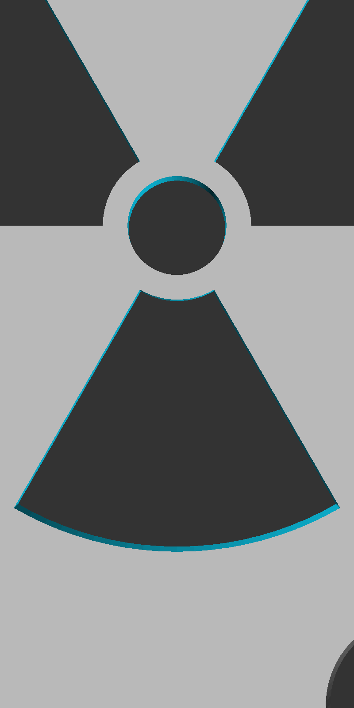
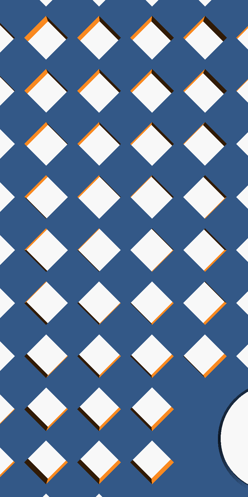
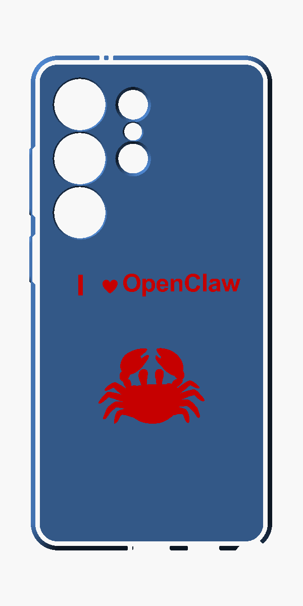

# Galaxy S26 Ultra — чехлы для телефона

Чехлы для Samsung Galaxy S26 Ultra с различными декоративными вырезами на задней панели. Базовая модель чехла (`galaxy-s26-ultra-case.stl`) модифицируется OpenSCAD-скриптами.

## Варианты

### Radiation (символ радиации)



Сквозной вырез символа радиации — через него виден жёлтый цвет телефона.

```bash
openscad -o radiation-case.stl radiation-case.scad
```

### Lattice (ромбовидная решётка)



Сетка ромбовидных вырезов по всей задней панели.

```bash
openscad -o lattice-case.stl lattice-case.scad
```

### Engraved text (гравировка)



Двухцветная гравировка текста и SVG-изображений. Текст врезается в поверхность, красная вкладка заполняет углубление.

```bash
# Корпус с гравировкой
openscad -D 'part="case"' -o case-engraved.stl add_text.scad
# Красная вкладка
openscad -D 'part="inlay"' -o text-red.stl add_text.scad
# Сборка 3MF для многоцветной печати
python3 build_3mf.py
```

## Файлы

| Файл | Описание |
|------|----------|
| `galaxy-s26-ultra-case.stl` | Базовая модель чехла (импортируется в .scad) |
| `radiation-case.scad` | Вырез символа радиации |
| `lattice-case.scad` | Ромбовидная решётка |
| `add_text.scad` | Гравировка текста + SVG |
| `build_3mf.py` | Сборка двухцветного 3MF |
| `crab.svg`, `heart.svg` | SVG-изображения для гравировки |
